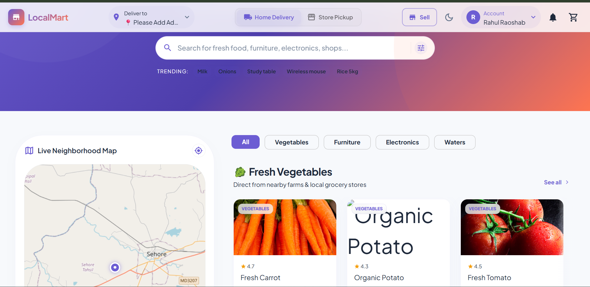
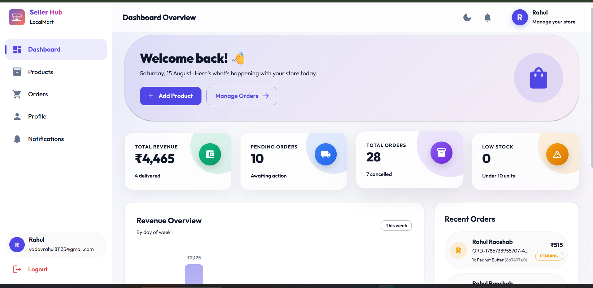
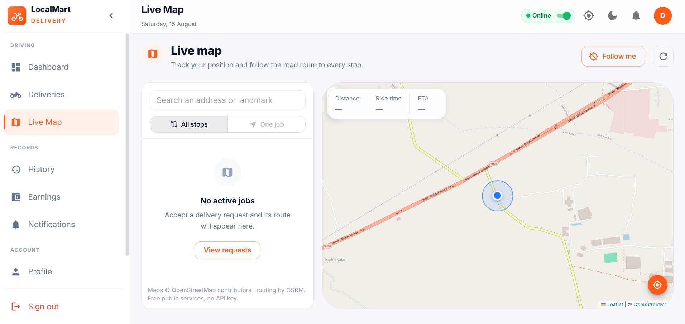

# LocalMart

**A hyperlocal e-commerce platform — Amazon/Flipkart-style marketplace meets Blinkit-style local delivery.**

LocalMart lets customers order groceries, essentials, and marketplace goods (electronics, furniture, and more) with two fulfillment choices for every product: **home delivery** or **store pickup** — while showing which nearby shops have the item in stock, whether they're open right now, and how far away they are.

---

## ✨ Core idea

Unlike a single-warehouse marketplace, LocalMart routes every order through **real, independent local shops**:

- 📍 See all nearby shops carrying a product — live open/closed status and distance
- 🚚 Choose **home delivery** from the nearest open shop
- 🏬 Or choose **store pickup** and collect it yourself
- 🛍️ Works for daily groceries *and* marketplace-style categories (furniture, electronics, etc.)
- 🧑‍💼 Shop owners manage their own inventory, orders, and revenue from a dedicated Seller Hub
- 🛵 Independent delivery partners accept jobs and navigate live routes from a dedicated Delivery app

---

## 🖥️ Demo screenshots

### Customer App — Home
Browse by category, see live nearby shops on the map, and pick delivery or pickup per product.



### Seller Hub — Dashboard
Shop owners track revenue, pending orders, low stock, and recent orders in real time.



### Delivery App — Live Map
Delivery partners go online, accept jobs, and follow a live route to each stop.



---

## 🏗️ Architecture

LocalMart is built as a **microservices backend** with three separate frontend apps, one per user role.

\```
LocalMart/
├── Backend/
│   ├── api-gateway/          # Single entry point routing to all services
│   ├── infrastructure/       # Shared infra config (docker, env, CI/CD, etc.)
│   └── Services/
│       ├── auth-service/         # Login, signup, sessions, JWT
│       ├── cart-service/         # Cart management per user
│       ├── delivery-service/     # Delivery partner assignment, live tracking, routes
│       ├── inventory-service/    # Per-shop stock levels
│       ├── notification-service/ # Push/email/SMS notifications
│       ├── order-service/        # Order lifecycle (placed → confirmed → fulfilled)
│       ├── payment-service/      # Payment processing & refunds
│       ├── product-service/      # Product catalog, categories, search
│       └── user-service/         # Customer, seller & delivery-partner profiles
│   └── shared/               # Shared types, utils, middleware across services
└── Frontend/
    ├── Customer-app/         # Where customers browse, order, and track deliveries
    ├── delivery-app/         # Where delivery partners accept jobs and navigate
    └── seller-app/           # Where shop owners manage products, orders & revenue
\```

**9 backend microservices** behind a single API gateway, and **3 role-specific frontend apps** sharing the same underlying platform.

---

## 🧩 Services overview

| Service | Responsibility |
|---|---|
| `api-gateway` | Routes requests from all frontends to the right microservice |
| `auth-service` | Authentication & authorization for customers, sellers, delivery partners |
| `cart-service` | Cart state, item quantities, per-shop cart splitting |
| `delivery-service` | Matches orders to nearby delivery partners, live location & route tracking |
| `inventory-service` | Tracks stock per product per shop, powers "in stock nearby" |
| `notification-service` | Order updates, delivery alerts, promotional notifications |
| `order-service` | Order creation, status transitions, delivery vs pickup logic |
| `payment-service` | Payment gateway integration, transactions, refunds |
| `product-service` | Product catalog, categories, search & filtering |
| `user-service` | Profile data for customers, sellers, and delivery partners |

---

## 📱 Frontend apps

| App | Users | Key features |
|---|---|---|
| **Customer-app** | Shoppers | Browse categories, live nearby-shop map, delivery/pickup toggle per product, cart, checkout, order tracking |
| **seller-app** | Shop owners | Dashboard (revenue, pending orders, low stock), product & inventory management, order fulfillment |
| **delivery-app** | Delivery partners | Go online/offline, accept delivery requests, live map with route/distance/ETA, earnings & history |

---

## 🛠️ Tech stack

> Fill in with your actual stack — placeholders below based on your folder structure.

- **Frontend:** React + Vite, Material UI (MUI)
- **Backend:** Node.js microservices behind an API gateway
- **Maps/Routing:** Leaflet + OpenStreetMap (OSRM for routing)
- **Database:** _add your DB(s) here, e.g. MongoDB / PostgreSQL_
- **Auth:** _e.g. JWT-based auth via auth-service_

---

## 🚀 Getting started

\```bash
# clone the repo
git clone <your-repo-url>
cd LocalMart

# backend — run each service
cd Backend/Services/<service-name>
npm install
npm run dev

# frontend — customer app
cd Frontend/Customer-app
npm install
npm run dev

# frontend — seller app
cd Frontend/seller-app
npm install
npm run dev

# frontend — delivery app
cd Frontend/delivery-app
npm install
npm run dev
\```

---

